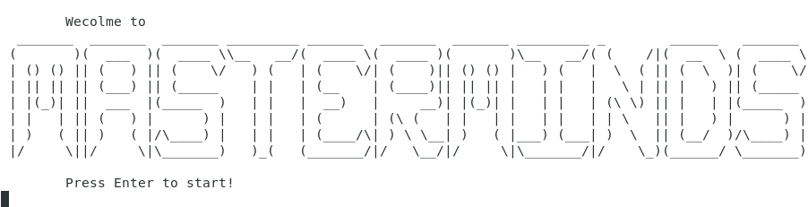
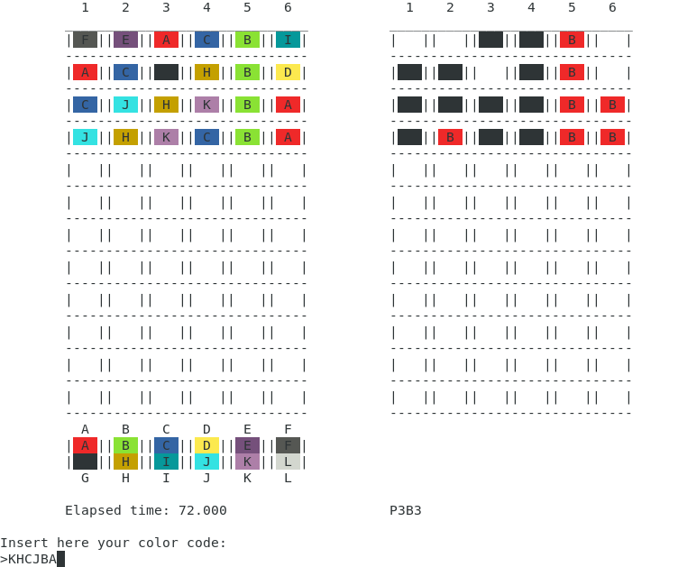

# Masterminds



Masterminds is a game which you have to guess a secret color code in a limited number of attempts.

This project was made for Programming class at Instituto Superior Técnico, University of Lisbon.

All the game was developed in C language, the object of Programming discipline, and runs over Linux Terminal or Windows Command Prompt.



It was made in collaboration with Martim Torres and have 3 development targets:
<dl>
  <dt><strong>1. Game user interface</strong></dt>
  <dd>This is related to the interactive part of the game and includes 4 game modes: Single Player, Multiplayer, Player vs. Player and Computer vs. Player</dd>
  <dt><strong>2. Computer guess algorithm</strong></dt>
  <dd>The algorithm to guess the given codes was used on Computer vs. Computer and Computer vs. Player modes.</dd>
  <dt><strong>3. History and Initializing</strong></dt>
  <dd>To start the program is possible to use an "init.dat" file, which will give parameters to the game that will be described ahead, and at the end of every realized game, it's data must be written at "historico.dat" in a specific format.</dd>
</dl>

## Rules

Rules are very simple. In all game modes, there will be a secret color code to be guessed. Whoever is trying to hit it need to make it before running out of time or trials.

After each attempt, white or red blocks at the right side of the board will indicate existing colors at the wrong place or right colors in the right place, respectively.

These rules are for all modes.

## Game Modes

There are 5 game modes available in the game. They are:

<dl>
  <dt><strong>1. Single Player</strong></dt>
  <dd>In this mode the player needs to discover the random code generated by the machine. The number of available attempts depends on chosen difficulty and code length.</dd>
  <dt><strong>2. Multiplayer</strong></dt>
  <dd>The rules are the same like in 1 player mode, each player will complete his game and in the end win who hits the code in fewer attempts.</dd>
  <dt><strong>3. Player versus Player</strong></dt>
  <dd>In the PvP mode, 2-4 players will compete against each other. First, one player will create a secret code, and then the other players will try to guess his code. Win who guess it first.</dd>
  <dt><strong>4. Computer versus Player</strong></dt>
  <dd>The roles are reversed. Now the player create a code to be discovered by the machine. You define how many tries and the code length. You think you're enough to can beat this amazing Artificial Intelligence?</dd>
  <dt><strong>5. Computer versus Computer</strong></dt>
  <dd>At this mode, the program generates a code and then try to guess it using a algorithm developed in the project for this purpose. And improves my grade at the discipline.</dd>
</dl>

## History

After every game, it's data is written at "historico.dat". The chosen structure to dispose those data is like the following example:

```
Control  Game   Player  Player    Code    Number of    Color      Secret   Number of   Game
 digit    ID      ID     name    Length    colors    repetition    code      tries     time
   G      001    P001   Gustavo     6        12          N        FELJHK       7        119

Control	 Try   Try    Blacks(P) &
 digit    ID   made    Whites(B)
   T      01  ABCDEF     P0B2
T 02 EFGHIJ P0B4
T 03 EFHJKL P1B5
T 04 FHKJLE P2B4
T 05 FKLJEH P3B3
T 06 FELJHL P5B1
T 07 FELJHK P6B0
G 002 P002 Martim 6 12 Y JKDABC 5 108
T 01 ABCDEF P0B4
T 02 BCDGHA P1B3
T 03 CIDJAB P1B4
T 04 KJDABC P4B2
T 05 JKDABC P6B0
```

A **control digit** is a way to know the type of data contained in the row. "G" is for general ame data, containing all game details, and "T" is for the made try, containing all the made try data.

## License
[GNU GPLv3](https://choosealicense.com/licenses/gpl-3.0/)
